# Golden Fleece — Study Guide

> A comprehensive guide for developers joining this project. Assumes familiarity with Python, React/Next.js, and general web development — but not with LangGraph, trading agents, blockchain trading, or ERC-8004.

---

## Table of Contents

1. [The Big Picture](#1-the-big-picture)
2. [The Hackathon](#2-the-hackathon)
3. [What is ERC-8004?](#3-what-is-erc-8004)
4. [How Blockchain Trading Works](#4-how-blockchain-trading-works)
5. [LangGraph and the Agent Loop](#5-langgraph-and-the-agent-loop)
6. [Our Architecture](#6-our-architecture)
7. [The Trading Strategy](#7-the-trading-strategy)
8. [The Trust Layer (Validation Artifacts)](#8-the-trust-layer-validation-artifacts)
9. [The Dashboard](#9-the-dashboard)
10. [The Codebase](#10-the-codebase)
11. [Key Concepts Glossary](#11-key-concepts-glossary)

---

## 1. The Big Picture

Golden Fleece is an **autonomous AI trading agent** that trades cryptocurrency on a test blockchain, makes every decision transparent, and builds a verifiable track record using a new Ethereum standard called ERC-8004.

The simplest way to think about it:

```
Traditional trading bot:          Golden Fleece:
┌───────────────┐                  ┌───────────────┐
│  See signal   │                  │  See signal   │
│  Make trade   │                  │  Make trade   │
│  Hope it works│                  │  Prove WHY    │ ← This is the difference
└───────────────┘                  │  Prove WHAT   │
                                   │  Prove HOW    │
                                   │  Anyone can   │
                                   │  verify it    │
                                   └───────────────┘
```

The pitch is: **"Not an AI that trades — a verifiable on-chain track record generator."** Anyone should be able to take our agent's published artifacts, re-check the math, verify the blockchain transactions, and confirm that the performance numbers are real. This is what ERC-8004 enables, and it's what the hackathon judges care most about.

---

## 2. The Hackathon

### Event Details

- **Name**: AI Trading Agents with ERC-8004
- **Platform**: lablab.ai (registration + submission) with Discord for communication
- **Dates**: March 9–22, 2026 (13 days)
- **Sponsor**: Surge (surge.xyz) — a multi-chain platform for AI-native capital formation

### Prize Pool ($50K USDC)

| Prize | Amount | What They're Looking For |
|-------|--------|--------------------------|
| Best Trustless Trading Agent | $10K + Trading Capital Program | Overall best: risk-adjusted returns, drawdown control, deep ERC-8004 use |
| Best Risk-Adjusted Return | $5K | Highest Sharpe ratio (consistency over raw profit) |
| Best Validation & Trust Model | $2.5K | Deepest integration with ERC-8004 validation |
| Best Yield/Portfolio Agent | $2.5K | DeFi yield strategies (lending, LP) |
| Best Compliance & Risk Guardrails | $2.5K | Strongest risk management |

**Important**: The top prize includes fast-tracking into Surge's Trading Capital Program — meaning the winning agent could manage real capital. Prizes go into trading accounts, not as direct cash payouts.

### Judging Criteria

1. **Technology application** (highest weight) — How deeply does the agent use ERC-8004?
2. **Presentation** — Demo video quality, dashboard polish, narrative clarity
3. **Business value** — Could this work in the real world?
4. **Originality** — Unique approach vs. other submissions

### Key Judges

- **Pawel Czech** (CEO of Surge) — Cares about business viability and alignment with Surge's capital program
- **Davide Crapis** (Ethereum Foundation, ERC-8004 co-author) — Will scrutinize architectural purity: hashes on-chain, evidence on IPFS, minimal on-chain footprint

### Submission Requirements

- Public GitHub repo (MIT license)
- Video presentation (this is critical — past lablab.ai winners emphasize polish)
- Slide deck
- Demo application URL
- X/Twitter post tagging **@lablabai** and **@Surgexyz_** (missing tags = disqualification)

### The Key Insight for Winning

Judges reward **risk-adjusted consistency over raw returns**. A Sharpe ratio of 2.0 with 8% max drawdown beats a Sharpe of 1.0 with 20% drawdown. In other words: don't try to make the most money — try to make money most consistently with the least risk, and prove every step.

---

## 3. What is ERC-8004?

### The Problem It Solves

Imagine you want to give an AI agent $10,000 to trade on your behalf. How do you:

- **Know it's really that agent?** (not an impersonator)
- **Check its track record?** (not self-reported, not fabricated)
- **Verify its decisions were sound?** (not just lucky)

Before ERC-8004, there was no standardized way to do any of this. AI agents on blockchains were opaque black boxes.

### The Solution: Three Registries

ERC-8004 defines three smart contracts (deployed on Ethereum and other chains) that together give AI agents verifiable identities and portable trust:

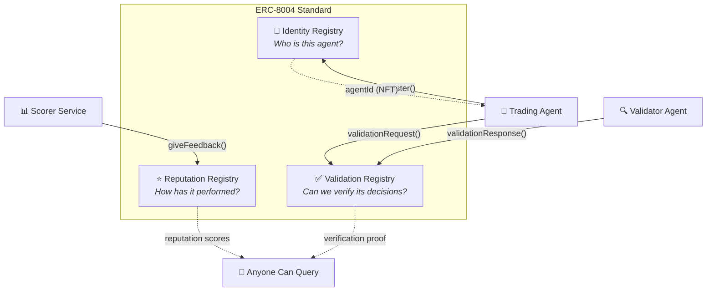

#### Registry 1: Identity

When an agent registers, it receives an **ERC-721 NFT** (a unique token on the blockchain). This NFT is the agent's on-chain identity card. It points to a JSON file (stored on IPFS) that describes the agent: its name, what it does, what services it offers, and what trust models it supports.

Think of it as a LinkedIn profile, but on-chain and cryptographically verified.

**Key operations:**
- `register()` → mints NFT, returns an `agentId`
- `setAgentURI(agentId, "ipfs://...")` → links to the agent's metadata
- `setAgentWallet(agentId, walletAddress)` → designates the wallet that signs trades

#### Registry 2: Reputation

After the agent trades, its performance gets recorded as structured feedback. Crucially, **the agent cannot rate itself** — the registry prevents the agent's owner from posting their own scores. A separate "scorer" service must do it.

Reputation is **multi-dimensional**, not a single number. Each feedback entry includes tags like:
- `tradingYield/day` — daily return percentage
- `sharpeRatio/week` — weekly risk-adjusted return
- `maxDrawdown/day` — worst daily loss from peak
- `successRate/week` — win rate over the week

This means anyone querying the reputation can see a nuanced picture: "This agent has a great Sharpe but its drawdown is concerning" rather than just "rating: 4.2 stars."

#### Registry 3: Validation

For every significant decision, the agent creates a **validation artifact** — a structured evidence bundle proving what data it saw, what it decided, why, and what happened. The hash of this bundle goes on-chain; the full content goes to IPFS.

A separate validator agent can then fetch the artifact, verify the math checks out, confirm the transactions exist, and post a validation response. This is the "show your work" layer.

### How It All Fits Together

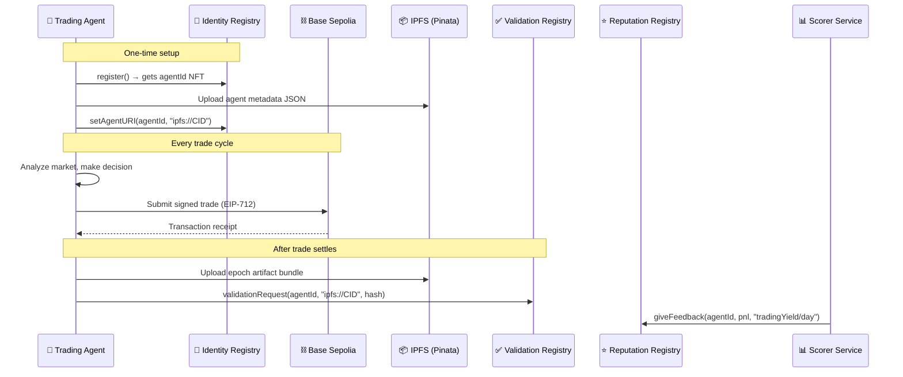

### Why ERC-721 (NFTs)?

You might wonder why agent identity is an NFT. It's because NFTs are:
- **Unique** — each agent gets exactly one identity
- **Transferable** — the agent identity can be sold or transferred
- **Composable** — other contracts can check `ownerOf(agentId)` to enforce permissions
- **Standard** — wallets, explorers, and marketplaces already understand ERC-721

### Contract Addresses (Base Sepolia)

| Registry | Address |
|----------|---------|
| Identity | `0x8004A818BFB912233c491871b3d84c89A494BD9e` |
| Reputation | `0x8004B663056A597Dffe9eCcC1965A193B7388713` |
| Validation | `0x8004Cb1BF31DAf7788923b405b754f57acEB4272` |

Note the `0x8004` prefix — these are vanity addresses deployed via CREATE2 to be recognizable.

---

## 4. How Blockchain Trading Works

If you've never traded on a blockchain, here's what's happening at each layer.

### The Basics

A **DEX** (Decentralized Exchange) is a smart contract that lets you swap one token for another without a middleman. Instead of an order book (like the stock market), DEXes use **liquidity pools** — pots of tokens that anyone can trade against.

We're using **Uniswap V3** on **Base Sepolia** (a test network). Base is an L2 (Layer 2) built on Ethereum that has faster, cheaper transactions.

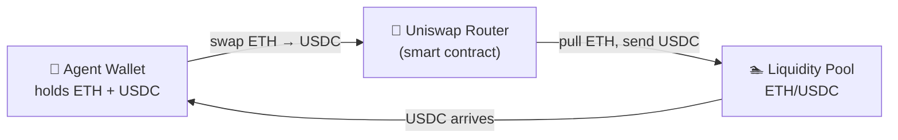

### Key Concepts

**Tokens**: Digital assets on the blockchain. We mainly trade:
- **WETH** (Wrapped ETH) — ETH in ERC-20 token form
- **USDC** — a stablecoin pegged to $1

**Slippage**: The difference between the expected price and the actual execution price. On testnet with thin liquidity, slippage can be significant. Our agent caps it at 2%.

**Gas**: Every blockchain transaction costs a small fee. On Base Sepolia, this is nearly free (~$0.000005 per transaction).

**EIP-712 (Typed Data Signing)**: Instead of just signing a blob of bytes, EIP-712 lets you sign a structured message that humans and contracts can read. Our agent signs "Trade Intents" this way:

```
TradeIntent {
  agentId: 42,
  tokenIn: WETH,
  tokenOut: USDC,
  amountIn: 0.1 ETH,
  minAmountOut: 250 USDC,
  deadline: 1710100000,
  nonce: 7,
  maxSlippageBps: 200     // 2% max slippage (basis points)
}
```

### The Risk Router

Our `RiskRouter.sol` contract sits between the agent and the DEX. It verifies the agent is registered (via Identity Registry) and the trade passes validation before executing. Think of it as a bouncer that checks your ID before letting you into the club.

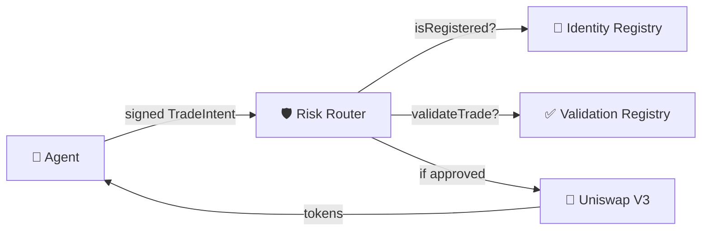

### Testnet vs. Mainnet

We're on **Base Sepolia** (testnet), not mainnet. This means:
- Tokens have **no real value** — they're free from faucets
- Liquidity is thin and erratic — price behavior doesn't match real markets
- We use **mainnet price data** (from APIs like GeckoTerminal) for analysis signals, but execute trades against testnet pools

This disconnect is intentional: the hackathon tests your system architecture, not whether you can predict real market moves.

---

## 5. LangGraph and the Agent Loop

### What is LangGraph?

LangGraph is a framework for building stateful, multi-step AI agent workflows as **directed graphs**. If you're familiar with state machines or data pipelines, it's the same idea applied to LLM-powered agents.

The core concepts:

| Concept | What It Is | Analogy |
|---------|-----------|---------|
| **StateGraph** | The blueprint for your agent's workflow | A flowchart |
| **State** | A TypedDict that flows through the graph | Data passing between pipeline stages |
| **Node** | A Python function that reads state and returns updates | A step in the pipeline |
| **Edge** | A connection between nodes | An arrow on the flowchart |
| **Conditional Edge** | A connection that routes based on state | A diamond (decision) on the flowchart |

### Why Not Just a Loop?

You could write `while True: monitor(); analyze(); decide(); execute()` — and for a hackathon, that might work. LangGraph gives you:

1. **Conditional routing** — Skip steps when they're not needed (no signal? Don't analyze)
2. **Checkpointing** — Save and resume state (crash recovery, debugging)
3. **Visualization** — The graph structure is inspectable and self-documenting
4. **Streaming** — Stream intermediate results to the dashboard in real-time

### Our Graph

Here's the actual graph we've built:

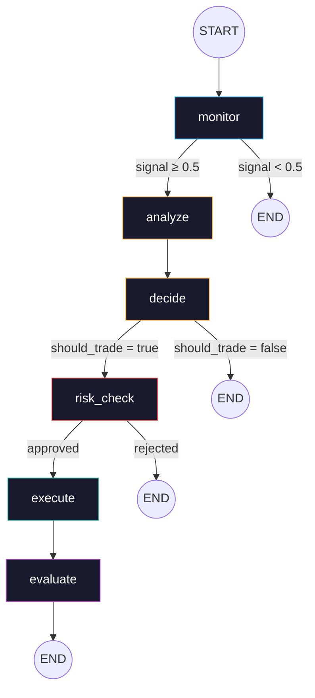

The graph has three "escape hatches" where it can end early:
1. **After monitor**: No signal detected → end (most cycles end here)
2. **After decide**: Analysis says don't trade → end
3. **After risk_check**: Circuit breakers reject the trade → end

### How State Flows

State is a Python `TypedDict` where every field is optional. Each node reads what it needs and returns only the fields it updates:

```python
# Monitor runs first, writes signal_score
def monitor(state: AgentState) -> AgentState:
    return {"signal_score": 0.82, "signal_metadata": {"source": "gecko"}}

# If signal_score >= 0.5, analyze runs next
def analyze(state: AgentState) -> AgentState:
    # Can read state["signal_score"] — it's 0.82
    return {"regime": "trending", "regime_confidence": 0.75}

# Decide reads both monitor and analyze outputs
def decide(state: AgentState) -> AgentState:
    # state["signal_score"] = 0.82, state["regime"] = "trending"
    return {"should_trade": True, "position_size": 0.05, ...}
```

LangGraph merges the returned dict into the running state after each node, so downstream nodes see everything upstream has written.

### How It Maps to the Code

```
apps/agent/src/trading_agent/
├── state.py          ← AgentState TypedDict (the shared data structure)
├── graph.py          ← StateGraph definition + conditional routing
├── server.py         ← FastAPI wrapper (HTTP + WebSocket)
└── nodes/
    ├── monitor.py    ← Node: signal detection (Haiku 4.5)
    ├── analyze.py    ← Node: regime detection (Sonnet 4.6)
    ├── decide.py     ← Node: position sizing (Sonnet 4.6)
    ├── risk_check.py ← Node: circuit breakers (pure Python, no LLM)
    ├── execute.py    ← Node: on-chain trade submission
    └── evaluate.py   ← Node: PnL + IPFS artifact creation
```

### The LLM Tiering

Not every step needs the most powerful model:

| Node | Model | Why |
|------|-------|-----|
| Monitor | Haiku 4.5 (`claude-haiku-4-5-20251001`) | Fast, cheap. Scans data every 15 min. ~$0.001/call |
| Analyze | Sonnet 4.6 (`claude-sonnet-4-6`) | Nuanced. Regime detection needs reasoning |
| Decide | Sonnet 4.6 (`claude-sonnet-4-6`) | High-stakes. Position sizing + reasoning |
| Risk Check | No LLM | Deterministic Python. LLMs must never control risk |
| Execute | No LLM | Mechanical. Sign and submit transaction |
| Evaluate | Sonnet 4.6 (`claude-sonnet-4-6`) | Structured. Post-trade analysis + artifact creation |

---

## 6. Our Architecture

### System Overview

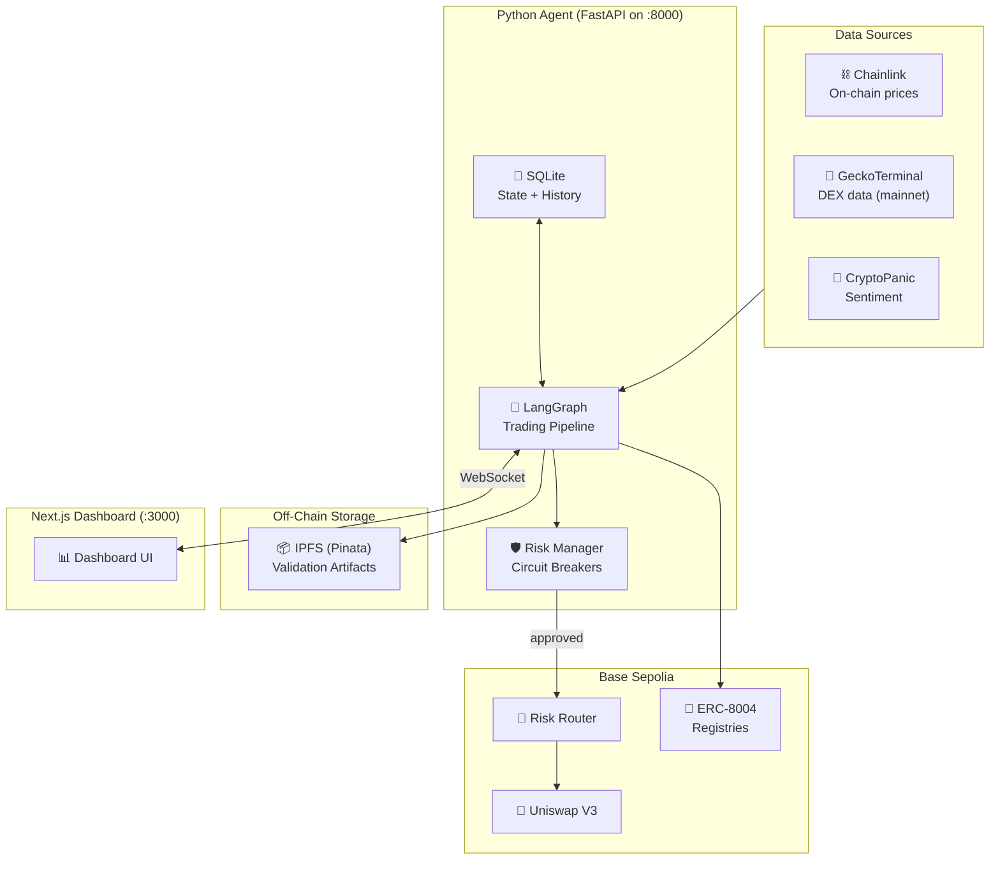

### Two-Server Architecture

The system runs as two servers:

1. **Python Agent** (port 8000) — The brain. Runs the LangGraph trading pipeline, makes LLM calls, manages risk, communicates with the blockchain
2. **Next.js Dashboard** (port 3000) — The face. Renders the UI, connects to the agent via WebSocket for real-time updates

They communicate via WebSocket (real-time state streaming) and REST (one-off requests like "run a cycle").

### The Wallet Architecture

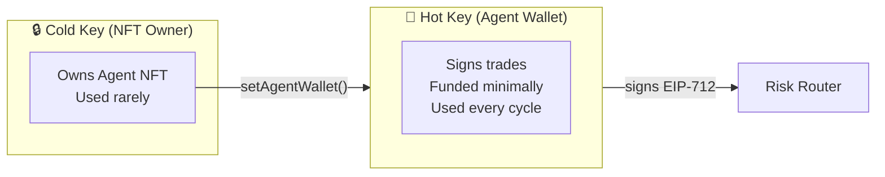

Two keys because security: even if the hot key is compromised, the attacker can only drain the small trading balance, not steal the agent identity.

---

## 7. The Trading Strategy

### The Barbell: Yield + Active Trading

Rather than going all-in on speculative trading, we split capital:

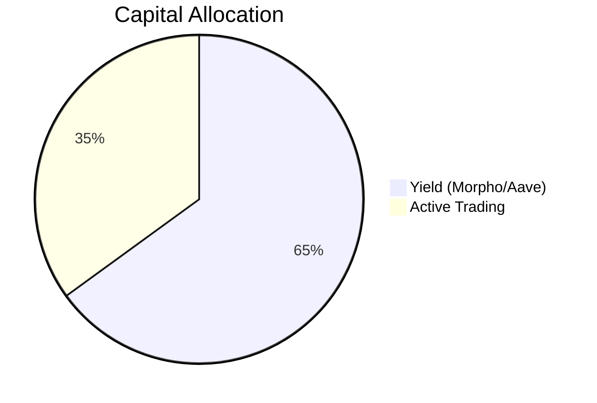

- **60–70% in yield protocols** (Morpho Blue, Aave V3) — Lend stablecoins, earn passive interest. This creates a guaranteed positive baseline even if active trading is flat.
- **30–40% in active trading** — AI-directed trades through the Risk Router, using momentum and mean-reversion strategies.

This is a deliberate choice: **judges reward Sharpe ratio (consistency), not raw PnL**. The yield floor elevates the Sharpe numerator.

### Market Regime Detection

The agent classifies the current market into one of four regimes and adjusts strategy accordingly:

| Regime | How It's Detected | Trading Strategy |
|--------|-------------------|------------------|
| **Trending** | ADX > 25 | Ride the trend (momentum), trailing stops |
| **Ranging** | ADX < 20, narrow Bollinger Bands | Buy low / sell high (mean-reversion) |
| **Volatile** | ADX < 20, wide Bollinger Bands | Cut positions 50%, widen stops |
| **Unknown** | Mixed signals | Hold stablecoins, wait for clarity |

**ADX** (Average Directional Index) measures trend strength. **Bollinger Bands** measure volatility relative to a moving average. These are the fastest indicators to implement and the most interpretable for judges.

### Position Sizing: Kelly Criterion

How much to bet on each trade? We use the **Kelly Criterion** — a mathematical formula from information theory that maximizes long-term growth:

```
Kelly% = (win_prob × win_loss_ratio - (1 - win_prob)) / win_loss_ratio
```

But full Kelly is dangerously aggressive for crypto (fat tails, extreme events), so we use **quarter Kelly** (25% of the calculated size). There's also a hard cap of 20% of portfolio per position.

**Critically**: The LLM proposes the win probability and win/loss ratio as part of its analysis, but the Kelly calculation is **deterministic Python** — the LLM never directly controls position size.

### Circuit Breakers

These are the most important part of risk management. They are **hard-coded rules** that override everything — including the LLM:

| Breaker | Trigger | Action |
|---------|---------|--------|
| Daily loss limit | -5% from day's peak | Liquidate to USDC, halt 12 hours |
| Max drawdown | -10% from all-time peak | Enter "safe mode" — USDC only |
| Consecutive losses | 3 losing trades in a row | Mandatory 6-hour cooldown |
| Slippage ceiling | >2% expected slippage | Reject the trade |
| Position concentration | >20% in one asset | Reject new buys of that asset |

These are non-negotiable. The LLM can argue "this is a great trade" all it wants — if drawdown is at 9.5%, the circuit breaker says no.

---

## 8. The Trust Layer (Validation Artifacts)

This is our competitive differentiator and what the hackathon values most.

### What Gets Recorded

For every significant action, the agent creates an **Epoch Artifact** — a bundle of JSON files proving exactly what happened:

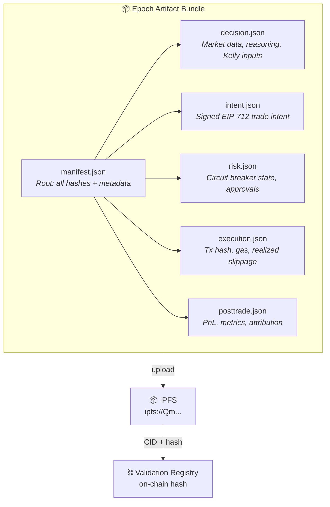

The `manifest.json` contains keccak256 hashes of every sub-file, plus the git commit hash of the agent's code. This means anyone can:

1. Download the manifest from IPFS
2. Download each sub-file
3. Hash them and verify they match the manifest
4. Check the manifest hash matches what's recorded on-chain
5. Verify the transaction hashes exist on Base Sepolia
6. Recompute the PnL from the raw trade data

### The Separate Validator Agent

A key architectural decision: we deploy a **second agent** with its own ERC-8004 identity. This validator:

1. Watches for the trading agent's `validationRequest` events
2. Fetches the IPFS artifact
3. Independently verifies hashes, transaction existence, and math
4. Posts `validationResponse` confirming (or denying) validity
5. Posts `giveFeedback` with performance scores

Why a separate agent? Because the Reputation Registry **prevents self-feedback** — the trading agent's owner cannot post its own scores. The validator provides genuine third-party verification.

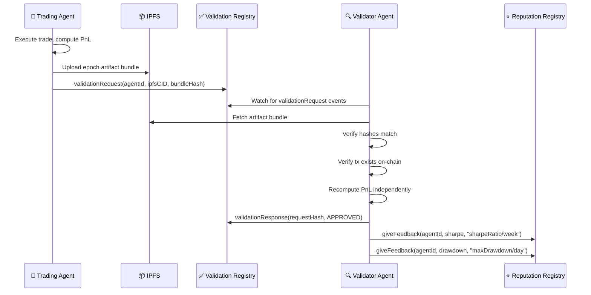

---

## 9. The Dashboard

The dashboard is both a monitoring tool and a **demo centerpiece**. Judges evaluate presentation quality heavily.

### Layout

```
┌──────────────────────────────────────────────────────────────────────┐
│  Golden Fleece                                      ● Agent Idle     │
├──────────┬──────────┬──────────┬──────────┬──────────┬──────────────┤
│   PnL    │  Sharpe  │ Drawdown │ Win Rate │  Regime  │   Status     │
│  $0.00   │   —      │   0%     │    —     │ Unknown  │   Idle       │
├──────────────────────────────────────────┬───────────────────────────┤
│                                          │                           │
│          Trading Chart                   │   Decision Reasoning      │
│       (Candlesticks + overlays)          │   (Timeline of Claude's   │
│                                          │    thinking per trade)    │
│                                          │                           │
├──────────────────────┬───────────────────┴───────────────────────────┤
│                      │                                               │
│   Risk Controls      │        ERC-8004 Trust Panel                   │
│  (Circuit breakers   │  (Identity, Reputation scores,                │
│   status indicators) │   Validation history, Verify button)          │
│                      │                                               │
└──────────────────────┴───────────────────────────────────────────────┘
```

### Key Panels

1. **Performance Cards** — Six KPI tiles: PnL, Sharpe, Drawdown, Win Rate, Current Regime, Agent Status
2. **Trading Chart** — TradingView Lightweight Charts with candlesticks, buy/sell markers, Bollinger Band overlays
3. **Decision Reasoning** — The "wow factor." Shows Claude's actual reasoning for each trade step: what it analyzed, why it decided to trade, what risk checks it passed, how the execution went
4. **Risk Controls** — Live circuit breaker status (green/red), drawdown meter, Kelly fraction gauge
5. **ERC-8004 Trust Panel** — Agent identity, reputation scores, recent validation events, "Verify" button that lets anyone check artifacts client-side
6. **Trade History** — Sortable table with tx hashes, PnL, slippage, linked IPFS artifacts

### Real-Time Updates

The dashboard connects to the Python agent via WebSocket. The agent broadcasts events as they happen:

| Event | When | What It Contains |
|-------|------|-----------------|
| `price_update` | Every 15s | Latest prices |
| `signal_generated` | When monitor detects signal | Signal score, metadata |
| `reasoning_update` | During analyze/decide | Claude's thinking |
| `trade_executed` | After execution | Tx hash, fill price, slippage |
| `metrics_update` | After evaluation | Updated PnL, Sharpe, drawdown |
| `risk_alert` | Circuit breaker trigger | Which breaker, current values |

---

## 10. The Codebase

### Monorepo Structure

```
golden-fleece-agent/
├── apps/
│   ├── agent/                    # Python — the trading brain
│   │   ├── src/trading_agent/
│   │   │   ├── graph.py          # LangGraph pipeline definition
│   │   │   ├── state.py          # AgentState TypedDict
│   │   │   ├── server.py         # FastAPI + WebSocket
│   │   │   ├── nodes/            # One file per pipeline step
│   │   │   ├── tools/            # LangGraph tool definitions
│   │   │   ├── data/             # Market data pipeline
│   │   │   └── erc8004/          # Registry interactions
│   │   ├── tests/
│   │   └── pyproject.toml
│   │
│   └── dashboard/                # Next.js — the monitoring UI
│       ├── src/
│       │   ├── app/page.tsx      # Main dashboard layout
│       │   ├── components/       # Chart, Reasoning, Risk, Trust panels
│       │   └── hooks/            # useWebSocket
│       └── package.json
│
├── contracts/                    # Foundry — Solidity smart contracts
│   ├── src/
│   │   ├── RiskRouter.sol        # Trade verification
│   │   └── interfaces/           # ERC-8004 interface stubs
│   ├── test/
│   │   ├── RiskRouter.t.sol      # Unit tests (mocks)
│   │   └── fork/ForkTest.t.sol   # Integration tests (Anvil fork)
│   └── foundry.toml
│
├── packages/
│   └── shared/                   # TypeScript types + ABIs
│       └── src/
│           ├── types/            # Mirrors Python AgentState
│           └── abis/             # Contract ABIs for viem
│
├── scripts/
│   ├── register-agent.ts         # ERC-8004 registration
│   └── bootstrap.sh              # Wallet provisioning
│
├── Makefile                      # Cross-language task runner
└── docs/                         # Research + implementation specs
```

### Key Commands

| Command | What It Does |
|---------|-------------|
| `make dev` | Starts both agent (port 8000) and dashboard (port 3000) |
| `make agent` | Starts just the Python agent |
| `make dashboard` | Starts just the Next.js dashboard |
| `make test` | Runs agent tests + contract tests |
| `make test-agent` | Runs Python tests only |
| `make test-contracts` | Runs Solidity unit tests only |
| `make test-fork` | Runs Solidity integration tests against Base Sepolia fork |
| `make lint` | Runs ruff (Python) + eslint (TypeScript) |
| `make install` | Installs all deps (uv sync + pnpm install + forge build) |

### Tech Stack Summary

| Layer | Technology | Why |
|-------|-----------|-----|
| Agent orchestration | LangGraph | Stateful graph with checkpointing, conditional routing |
| LLM | Claude (Haiku 4.5 / Sonnet 4.6 / Opus 4.6) | Tiered by cost and capability per task |
| Agent server | FastAPI + uvicorn | Async Python, WebSocket support, simple |
| Dashboard | Next.js 16 + Tailwind + shadcn/ui | Fast, good defaults, dark theme support |
| Charts | TradingView Lightweight Charts | Industry standard, 45KB, candlestick support |
| Smart contracts | Foundry (Solidity) | Fastest Solidity toolkit, two-layer testing |
| Blockchain interaction | viem (TS) / web3.py (Python) | Type-safe, modern libraries |
| IPFS | Pinata | Managed pinning service, free tier sufficient |
| Python packaging | uv | 10–100x faster than pip |
| JS packaging | pnpm | Workspace support, fast, disk-efficient |
| Testing | pytest + forge test | Two-layer: mock (fast) + fork (integration) |

### Data Flow: One Trading Cycle

```mermaid
graph TD
    subgraph Monitor["1. Monitor (Haiku 4.5)"]
        M1["Fetch prices from Chainlink"]
        M2["Fetch DEX data from GeckoTerminal"]
        M3["Check sentiment from CryptoPanic"]
        M4["Score signal strength: 0.82"]
    end

    subgraph Analyze["2. Analyze (Sonnet 4.6)"]
        A1["Compute ADX, Bollinger Bands"]
        A2["Detect regime: trending"]
        A3["Identify WETH/USDC momentum opportunity"]
    end

    subgraph Decide["3. Decide (Sonnet 4.6)"]
        D1["Estimate: 62% win prob, 1.8:1 ratio"]
        D2["Quarter Kelly = 5% of portfolio"]
        D3["Decision: LONG WETH, 0.05 ETH"]
    end

    subgraph RiskCheck["4. Risk Check (Pure Python)"]
        R1["Daily loss: -1.2% ✅ (limit: -5%)"]
        R2["Max drawdown: -3.4% ✅ (limit: -10%)"]
        R3["Slippage est: 0.8% ✅ (limit: 2%)"]
        R4["Position size: 5% ✅ (limit: 20%)"]
        R5["APPROVED"]
    end

    subgraph Execute["5. Execute (On-Chain)"]
        E1["Create EIP-712 TradeIntent"]
        E2["Sign with agent wallet"]
        E3["Submit to Risk Router"]
        E4["Router swaps via Uniswap V3"]
        E5["Tx: 0xabc...def"]
    end

    subgraph Evaluate["6. Evaluate (Sonnet 4.6)"]
        EV1["Compute PnL: +$12.50"]
        EV2["Update Sharpe: 1.82"]
        EV3["Create epoch artifact bundle"]
        EV4["Upload to IPFS: ipfs://Qm..."]
        EV5["Submit validationRequest on-chain"]
    end

    Monitor --> Analyze --> Decide --> RiskCheck --> Execute --> Evaluate
```

---

## 11. Key Concepts Glossary

| Term | Definition |
|------|-----------|
| **ADX** | Average Directional Index — measures trend strength (0–100). Above 25 = trending. |
| **Anvil** | Local Ethereum node by Foundry. Can "fork" a real network for testing. |
| **Base Sepolia** | Coinbase's L2 test network. Chain ID 84532. Nearly free transactions. |
| **Bollinger Bands** | Price bands around a moving average that widen with volatility. |
| **Circuit Breaker** | Hard-coded rule that halts trading when risk thresholds are exceeded. |
| **DEX** | Decentralized Exchange — a smart contract for trading tokens without a middleman. |
| **EIP-712** | Standard for signing structured/typed data (not just raw bytes). Used for TradeIntents. |
| **ERC-721** | The NFT standard. ERC-8004 uses it for agent identity tokens. |
| **ERC-8004** | Ethereum standard for AI agent identity, reputation, and validation registries. |
| **Epoch Artifact** | A bundle of JSON files proving one complete trading decision + outcome. |
| **Foundry** | Solidity development toolkit (forge for building/testing, anvil for local chains, cast for CLI). |
| **IPFS** | InterPlanetary File System — decentralized content-addressed storage. Files identified by hash. |
| **Kelly Criterion** | Mathematical formula for optimal bet sizing given win probability and payoff ratio. |
| **L2 (Layer 2)** | A blockchain built on top of Ethereum for faster, cheaper transactions. Base is an L2. |
| **LangGraph** | Framework for building stateful LLM agent workflows as directed graphs. |
| **Liquidity Pool** | A pot of tokens on a DEX that traders swap against. |
| **Pinata** | Managed IPFS pinning service (ensures your files stay available). |
| **Sharpe Ratio** | Risk-adjusted return metric: (return - risk-free rate) / volatility. Higher = better. |
| **Slippage** | Difference between expected and actual trade execution price. |
| **Sortino Ratio** | Like Sharpe but only penalizes downside volatility (more relevant for trading). |
| **StateGraph** | LangGraph class for defining a graph where state flows between node functions. |
| **Testnet** | A blockchain network for testing (free tokens, no real money). |
| **TradeIntent** | An EIP-712 typed message describing a desired trade (tokens, amounts, limits). |
| **UUPS Proxy** | An upgradeable smart contract pattern. The ERC-8004 registries use this. |
| **viem** | Modern TypeScript library for Ethereum interaction. |
| **WETH** | Wrapped ETH — ETH as an ERC-20 token (needed for DEX compatibility). |
| **web3.py** | Python library for Ethereum interaction. |

---

## Next Steps

If you're new to the project, recommended reading order:

1. **This document** (you're here)
2. `docs/impl/01-ERC8004-INTEGRATION.md` — Deep dive on ERC-8004
3. `docs/impl/04-AGENT-ARCHITECTURE.md` — Agent design decisions
4. `docs/impl/06-TRADING-STRATEGY.md` — Strategy details
5. `docs/impl/07-VALIDATION-AND-TRUST.md` — Trust layer design
6. `docs/impl/10-HACKATHON-STRATEGY.md` — Timeline and competitive strategy
7. Browse the code: start with `apps/agent/src/trading_agent/graph.py`

To run the project locally:

```bash
make install    # Install all dependencies
make test       # Verify everything works
make dev        # Start agent + dashboard
```

Then open `http://localhost:3000` for the dashboard and `http://localhost:8000/docs` for the agent's API documentation.
