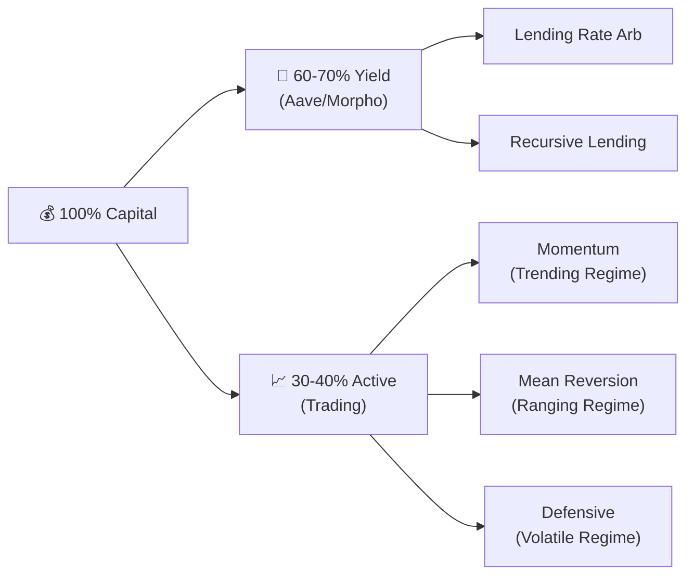
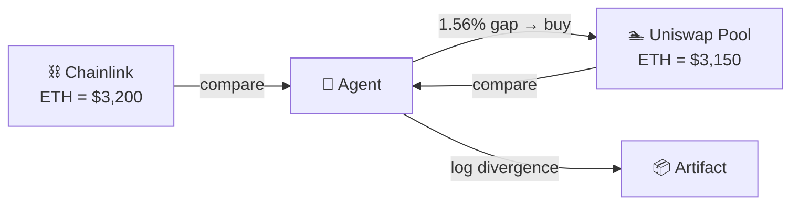

# Golden Fleece — Trading Strategies Playbook

> Comprehensive catalog of trading strategies for the ERC-8004 hackathon. Covers what we've planned, what else is viable, and what to avoid — all evaluated against the specific constraints of a 13-day competition on Base Sepolia where **Sharpe ratio matters more than raw PnL**.

---

## Table of Contents

1. [The Optimization Target](#1-the-optimization-target)
2. [Constraints That Shape Strategy](#2-constraints-that-shape-strategy)
3. [Portfolio Architecture](#3-portfolio-architecture)
4. [Yield Strategies (The Floor)](#4-yield-strategies-the-floor)
5. [Momentum Strategies](#5-momentum-strategies)
6. [Mean Reversion Strategies](#6-mean-reversion-strategies)
7. [Arbitrage Strategies](#7-arbitrage-strategies)
8. [Volatility Strategies](#8-volatility-strategies)
9. [DEX-Native Strategies](#9-dex-native-strategies)
10. [Portfolio Construction](#10-portfolio-construction)
11. [Risk Management](#11-risk-management)
12. [Strategies to Avoid](#12-strategies-to-avoid)
13. [Implementation Priority](#13-implementation-priority)

---

## 1. The Optimization Target

The hackathon doesn't reward whoever makes the most money. It rewards **risk-adjusted consistency**. Here's the scoring function we're optimizing for:

```
Sharpe Ratio = mean(excess_returns) / std(excess_returns) × √(periods)
```

This means:
- **High, steady returns** beat large, volatile returns
- **Low drawdowns** matter more than high peaks
- A strategy that earns 0.5% daily with 0.2% std (Sharpe ~2.5) demolishes one that earns 2% daily with 3% std (Sharpe ~0.67)

The judges also evaluate max drawdown, Sortino ratio, Calmar ratio, and win rate — all of which reward consistency over aggression.

### What This Means for Strategy Selection

```mermaid
quadrantChart
    title Strategy Selection Framework
    x-axis Low Sharpe --> High Sharpe
    y-axis Low Complexity --> High Complexity
    quadrant-1 Avoid (hard + bad risk)
    quadrant-2 Only if time (hard + good risk)
    quadrant-3 Implement first (easy + good risk)
    quadrant-4 Skip (easy + bad risk)
    Lending Rate Arb: [0.75, 0.15]
    Recursive Lending: [0.70, 0.35]
    Vol Targeting: [0.80, 0.20]
    Z-Score MeanRev: [0.78, 0.30]
    Donchian Breakout: [0.62, 0.25]
    RSI Momentum: [0.60, 0.30]
    Oracle-DEX Arb: [0.55, 0.55]
    Concentrated LP: [0.30, 0.75]
    Flash Loan Arb: [0.35, 0.80]
    Pairs Trading: [0.65, 0.85]
```

**Prioritize strategies in the bottom-right**: high Sharpe, low complexity.

---

## 2. Constraints That Shape Strategy

Every strategy must be evaluated against these hackathon-specific realities:

| Constraint | Impact |
|-----------|--------|
| **13 days** | Not enough time for statistical significance. Strategies needing weeks of calibration data are at a disadvantage. |
| **Testnet liquidity** | Base Sepolia pools are thin and erratic. Large orders will move prices dramatically. |
| **No real price discovery** | Testnet tokens have no real value. We use mainnet data for signals but execute against testnet pools. |
| **Near-zero gas** | ~$0.000005/tx. Strategies that are uneconomical on mainnet (frequent rebalancing, small arb) become free. |
| **No MEV competition** | No searchers, no flashbots, no block builders competing. Arb opportunities persist longer. |
| **Judges value artifacts** | Every trade needs a validation artifact. Strategies with clear reasoning (regime detection, Kelly sizing) are more explainable than black-box approaches. |
| **Available protocols** | Uniswap V3, Aave V3, Morpho Blue. No options, no perps, no orderbooks. |
| **2 primary tokens** | WETH and USDC. Limited pair universe constrains statistical approaches. |

---

## 3. Portfolio Architecture

### The Barbell (Current Plan)

Split capital into a low-risk yield floor and a higher-risk active trading allocation:



**Why this works**: The yield floor generates steady positive returns even when active trading is flat or slightly negative. This elevates the Sharpe numerator (mean return) without adding volatility to the denominator.

### Enhanced Barbell (Proposed)

Add a third tier for opportunistic strategies that activate only under specific conditions:

```mermaid
graph TD
    Capital["💰 100% Capital"] --> Yield["🏦 55-65% Yield Floor"]
    Capital --> Active["📈 25-35% Active Trading"]
    Capital --> Opp["⚡ 5-10% Opportunistic"]

    Yield --> Y1["Lending optimization"]
    Yield --> Y2["Recursive looping"]

    Active --> A1["Regime-aware trading"]
    Active --> A2["Vol-targeted sizing"]

    Opp --> O1["Oracle-DEX arb<br/><i>(when divergence detected)</i>"]
    Opp --> O2["Cross-pool arb<br/><i>(when fee tiers misalign)</i>"]

    style Yield fill:#1a3a1a,stroke:#26a69a
    style Active fill:#1a1a3a,stroke:#4fc3f7
    style Opp fill:#3a1a1a,stroke:#ffb74d
```



The opportunistic tier is capital-efficient (flash-loan-powered or small allocations) and only activates when clear opportunities exist, contributing return without persistent risk.

---

## 4. Yield Strategies (The Floor)

These strategies form the guaranteed baseline. They run continuously regardless of market conditions.

### 4.1 Lending Rate Optimization

**How it works**: Monitor supply APYs across Aave V3 and Morpho Blue. Move stablecoins to whichever protocol offers higher yield. Near-zero gas makes even tiny rate differentials profitable.

**Mechanics**:
```
Every 30 minutes:
  1. Query Aave V3 supply APY for USDC
  2. Query Morpho Blue supply APY for USDC
  3. If difference > threshold (0.1%):
     - Withdraw from lower-APY protocol
     - Deposit to higher-APY protocol
  4. Log rotation in validation artifact
```

| Property | Value |
|----------|-------|
| Expected Sharpe contribution | +0.3 to +0.5 (steady, low-vol returns) |
| Complexity | Very low — read rates, compare, rotate |
| Testnet viability | High — both protocols deployed on Base Sepolia |
| Risk | Near-zero. Worst case: smart contract bug in Aave/Morpho |
| Artifact value | Shows systematic yield optimization for judges |

**Implementation priority**: Day 1. This should be earning from the first hour.

### 4.2 Recursive Lending (Looping)

**How it works**: Use flash loans to create leveraged lending positions. Deposit USDC → borrow USDC at lower rate → deposit again → repeat. This multiplies the spread between deposit APY and borrow APY.

**Mechanics**:
```
1. Flash loan 100,000 USDC from Aave
2. Deposit 100,000 USDC as collateral (earn supply APY)
3. Borrow 75,000 USDC against it (pay borrow APY, lower than supply)
4. Deposit the 75,000 USDC again
5. Borrow 56,250 USDC... repeat N times
6. Repay flash loan

Net effect: You have N× leverage on the supply-borrow spread.
Effective APY: base_spread × leverage_factor
```

A conservative 2x loop on a 3.1% base spread yields ~6.2% APY.

| Property | Value |
|----------|-------|
| Expected Sharpe contribution | +0.4 to +0.7 |
| Complexity | Medium — flash loan interaction, health factor monitoring |
| Testnet viability | High — Aave V3 supports flash loans on Base Sepolia |
| Risk | Liquidation if borrow rates spike above supply rates. Mitigate by monitoring health factor and unwinding if it drops below 1.5 |
| Artifact value | High — flash loan usage impresses judges ("Best Yield/Portfolio Agent" track) |

**Implementation priority**: Days 2-3. Build after basic lending is working.

### 4.3 Vault Rotation (Morpho Blue Markets)

**How it works**: Morpho Blue has isolated lending markets with different risk/reward profiles. Monitor all available markets and rotate capital to the highest risk-adjusted yield.

| Property | Value |
|----------|-------|
| Expected Sharpe contribution | +0.1 to +0.3 (marginal over basic lending) |
| Complexity | Low-medium |
| Testnet viability | Medium — depends on how many Morpho markets are deployed |
| Implementation priority | Days 5-7 if multiple markets exist |

---

## 5. Momentum Strategies

These activate in **trending** regimes (ADX > 25). The core idea: when markets are directional, ride the trend.

### 5.1 Donchian Channel Breakout

**How it works**: Buy when price breaks above the highest high of the last N periods. Sell when it breaks below the lowest low. This is the classic "turtle trading" strategy, adapted for crypto.

**Mechanics**:
```python
def donchian_signal(prices: list[float], period: int = 20) -> str:
    upper = max(prices[-period:])
    lower = min(prices[-period:])
    current = prices[-1]

    if current >= upper:
        return "long"      # New high → trend confirmation
    elif current <= lower:
        return "short"     # New low → downtrend confirmation
    return "hold"
```

**Exit**: ATR-based trailing stop (2-3× ATR). This lets winners run in strong trends while cutting losers quickly. Time-based exit (max 48h) as failsafe.

| Property | Value |
|----------|-------|
| Expected Sharpe | 0.8–1.5 in trending markets, negative in ranging |
| Complexity | Very low — 10 lines of Python |
| Testnet viability | Medium-high — uses mainnet oracle prices as signals |
| Risk | Whipsaws in choppy markets. Mitigated by only activating in trending regime |
| Key advantage | Most interpretable for judges — "price made a new 20-period high, we went long" |

**Why this over complex alternatives**: Donchian breakout is one of the few strategies with a 50-year track record. Judges can immediately understand the logic. Complexity doesn't win hackathons — clarity does.

### 5.2 RSI Momentum with Volatility Filter

**How it works**: Enter long when RSI crosses above 55 (not just oversold→overbought, which is mean reversion). The insight is using RSI as a momentum indicator, not a contrarian one.

**Mechanics**:
```
Entry long:  RSI(14) crosses above 55 AND vol_filter is True
Entry short: RSI(14) crosses below 45 AND vol_filter is True
Exit:        RSI reaches extreme (>75 or <25) OR trailing stop hit

vol_filter = realized_vol < 1.5 × median_vol  # Don't trade during vol spikes
```

| Property | Value |
|----------|-------|
| Expected Sharpe | 1.0–1.5 when combined with vol filter |
| Complexity | Low |
| Testnet viability | Medium-high — signal from mainnet data |
| Risk | False signals during regime transitions |

### 5.3 Dual Moving Average Crossover

**How it works**: Go long when the fast SMA (e.g., 10-period) crosses above the slow SMA (e.g., 30-period). Reverse on the opposite cross.

| Property | Value |
|----------|-------|
| Expected Sharpe | 0.5–1.0 (lower than Donchian due to lag) |
| Complexity | Very low |
| Testnet viability | Medium-high |
| Risk | Lag means late entries and exits. Bad in choppy markets |

**Verdict**: Implement as a confirmation signal alongside Donchian, not as a standalone strategy.

---

## 6. Mean Reversion Strategies

These activate in **ranging** regimes (ADX < 20, narrow Bollinger Bands). The core idea: when markets are range-bound, buy dips and sell rips.

### 6.1 Z-Score Mean Reversion (Recommended)

**How it works**: Compute how many standard deviations the current price is from its rolling mean. When the z-score exceeds a threshold, bet on reversion to the mean.

**Mechanics**:
```python
def zscore_signal(prices: list[float], lookback: int = 20, entry_z: float = 2.0) -> str:
    mean = sum(prices[-lookback:]) / lookback
    std = (sum((p - mean)**2 for p in prices[-lookback:]) / lookback) ** 0.5
    z = (prices[-1] - mean) / std if std > 0 else 0

    if z < -entry_z:
        return "long"      # Price is 2σ below mean → expect bounce
    elif z > entry_z:
        return "short"     # Price is 2σ above mean → expect pullback
    return "hold"
```

**Exit**: Price returns to mean (z-score crosses 0) OR time-based exit (max 24h). **Not** a stop-loss — mean reversion expects temporary adverse moves. Portfolio-level circuit breakers provide the safety net.

| Property | Value |
|----------|-------|
| Expected Sharpe | 1.5–2.5 in ranging markets (one of the best risk-adjusted strategies) |
| Complexity | Low — basic statistics |
| Testnet viability | Medium-high — oracle price signals |
| Risk | Regime change: if a ranging market suddenly trends, mean reversion gets crushed |
| Key advantage | High win rate (70%+), which looks great on the dashboard |

**Why z-score is our primary mean reversion strategy**: It naturally adapts to volatility (the standard deviation scales the entry threshold) and produces the cleanest Sharpe ratio of any single strategy in ranging regimes.

### 6.2 Bollinger Band Bounce

**How it works**: Buy when price touches the lower Bollinger Band and RSI confirms oversold (<30). Sell when price touches the upper band and RSI confirms overbought (>70).

| Property | Value |
|----------|-------|
| Expected Sharpe | 1.0–2.0 in ranging markets |
| Complexity | Low |
| Testnet viability | Medium-high |
| Risk | Same as z-score — regime change kills it |

**Verdict**: Use as confirmation for z-score signals, not standalone. If both z-score AND Bollinger say "buy," confidence is higher.

---

## 7. Arbitrage Strategies

These are **regime-independent** — they profit from pricing inefficiencies regardless of market direction.

### 7.1 Oracle-DEX Arbitrage (Most Promising Testnet Arb)

**How it works**: On mainnet, Chainlink oracle prices and Uniswap pool prices stay tightly aligned because arbitrageurs correct any divergence. On testnet, **there are no active arbitrageurs** — so Chainlink prices (which track mainnet) can diverge significantly from Uniswap testnet pool prices.

**Mechanics**:
```
Every 5 minutes:
  1. Read Chainlink ETH/USD price → $3,200
  2. Read Uniswap WETH/USDC pool price → $3,150 (1.56% below oracle)
  3. If divergence > 1%:
     - Buy WETH on Uniswap (cheap vs. oracle)
     - Wait for pool price to converge (or sell when divergence reverses)
  4. Log oracle price, pool price, divergence in artifact
```



| Property | Value |
|----------|-------|
| Expected Sharpe | Hard to estimate — depends on divergence frequency and magnitude |
| Complexity | Medium — price feed reading + swap execution |
| Testnet viability | Medium — relies on testnet pool prices diverging from oracle |
| Risk | Pool may not converge. Slippage in thin pools eats profits |
| Key advantage | Market-neutral, no directional bet. Unique to testnet environment |

**Implementation priority**: Days 5-7 as an opportunistic add-on.

### 7.2 Cross-Pool Fee Tier Arbitrage

**How it works**: Uniswap V3 allows the same token pair to have multiple pools at different fee tiers (0.05%, 0.3%, 1%). If these pools have different prices, arbitrage between them.

**Mechanics**: Flash-swap from cheap pool, sell in expensive pool, pocket the difference minus fees.

| Property | Value |
|----------|-------|
| Expected Sharpe | Marginal — small, infrequent opportunities |
| Complexity | Medium — requires checking all pool variants |
| Testnet viability | Low-medium — may not have multiple active fee tiers for the same pair |
| Implementation priority | Day 8+ if fee tier pools exist |

### 7.3 Flash Loan-Powered Arbitrage

**How it works**: Use Aave V3 flash loans to execute arb with zero capital at risk. Borrow → arb → repay in one transaction. If the arb isn't profitable after fees, the transaction reverts (atomic safety).

| Property | Value |
|----------|-------|
| Expected Sharpe | Theoretically infinite (zero capital at risk) but practically rare |
| Complexity | High — smart contract or complex transaction batching |
| Testnet viability | Low — needs multiple price discrepancies across protocols |
| Artifact value | Very high — judges love flash loan usage |
| Implementation priority | Day 8+ as a showcase feature |

---

## 8. Volatility Strategies

These don't trade directionally — they trade the level and changes of volatility itself.

### 8.1 Volatility Targeting (Highest Priority Overlay)

**How it works**: Instead of using a fixed position size, scale position size inversely with realized volatility. When markets are calm, trade bigger. When markets are wild, trade smaller.

**This is not a standalone strategy — it's an overlay that improves the Sharpe of every other strategy.**

**Mechanics**:
```python
def vol_targeted_size(
    base_size: float,
    realized_vol: float,
    target_vol: float = 0.15,  # 15% annualized target
) -> float:
    """Scale position size to maintain constant portfolio volatility."""
    if realized_vol <= 0:
        return base_size
    scalar = target_vol / realized_vol
    return base_size * min(scalar, 2.0)  # Cap at 2× to prevent overleverage
```

**Why this is so powerful**: Research consistently shows vol targeting adds 0.3-0.5 to Sharpe ratio across virtually all strategy types. It's a free lunch in terms of risk-adjusted performance.

```mermaid
graph TD
    subgraph Without["Without Vol Targeting"]
        W1["Calm market → $100 position"]
        W2["Wild market → $100 position"]
        W3["Result: inconsistent risk"]
    end

    subgraph With["With Vol Targeting"]
        V1["Calm market → $150 position<br/>(vol is low, size up)"]
        V2["Wild market → $60 position<br/>(vol is high, size down)"]
        V3["Result: constant risk exposure"]
    end

    style With fill:#1a3a1a,stroke:#26a69a
```



| Property | Value |
|----------|-------|
| Expected Sharpe improvement | +0.3 to +0.5 on top of any strategy |
| Complexity | Very low — 5 lines of Python |
| Testnet viability | High |
| Implementation priority | **Day 1.** Apply to every trade from the start. |

### 8.2 Volatility Regime Switching (The Meta-Strategy)

**How it works**: This is the regime detection system from the current plan, now understood as a volatility strategy. Instead of running one strategy all the time, switch between strategies based on which volatility regime we're in.

```mermaid
graph TD
    Market["📊 Market Data"] --> Regime["🔍 Regime Detection<br/>(ADX + Bollinger Width)"]

    Regime -->|"ADX > 25"| Trending["📈 Trending<br/>→ Donchian Breakout<br/>→ Full position size"]
    Regime -->|"ADX < 20<br/>Narrow BB"| Ranging["↔️ Ranging<br/>→ Z-Score Mean Reversion<br/>→ Full position size"]
    Regime -->|"ADX < 20<br/>Wide BB"| Volatile["🌊 Volatile<br/>→ Defensive<br/>→ Half position size"]
    Regime -->|"Mixed signals"| Unknown["❓ Unknown<br/>→ Yield only<br/>→ No active trades"]

    style Trending fill:#1a3a1a,stroke:#26a69a
    style Ranging fill:#1a1a3a,stroke:#4fc3f7
    style Volatile fill:#3a2a1a,stroke:#ffb74d
    style Unknown fill:#2a1a1a,stroke:#ef5350
```



| Property | Value |
|----------|-------|
| Expected Sharpe improvement | +0.3 to +0.8 (avoids using wrong strategy for conditions) |
| Complexity | Low-medium — regime detection + strategy routing |
| Implementation priority | Day 2-3. Core of the active trading system. |

**Key insight**: The regime detector is more important than any individual strategy. A mediocre momentum strategy in a trending market beats a great mean reversion strategy in the same market. Getting the regime right is 70% of the battle.

---

## 9. DEX-Native Strategies

Strategies that exploit mechanics specific to decentralized exchanges.

### 9.1 Concentrated Liquidity Provision

**How it works**: In Uniswap V3, LPs can concentrate their liquidity in a specific price range instead of spreading it across all prices. If the price stays in your range, you earn fees on a much higher effective capital base.

**Mechanics**: Deposit WETH + USDC as an LP position centered on the current price with a tight range (e.g., ±2%). Earn swap fees from everyone trading in that range.

| Property | Value |
|----------|-------|
| Expected Sharpe | Low on testnet — almost no trading volume means almost no fees |
| Complexity | High — range management, impermanent loss tracking, rebalancing |
| Testnet viability | Low — the strategy's profit comes from fees, which need volume |
| Risk | Impermanent loss if price moves out of range |

**Verdict**: Skip unless testnet has unexpectedly high volume. The return doesn't justify the complexity for this hackathon.

### 9.2 Sandwich Protection (Demonstration Value)

**How it works**: Not a profit strategy — this is a defensive feature that shows production-readiness. When submitting swaps, use:
- Private mempools (if available)
- Tight slippage limits
- Deadline enforcement
- Batch transactions to reduce attack surface

| Property | Value |
|----------|-------|
| Profit contribution | Zero — purely defensive |
| Artifact value | Medium — shows awareness of MEV risks |
| Complexity | Low |
| Implementation priority | Days 8-10 as a polish feature for the "Compliance & Risk" prize track |

---

## 10. Portfolio Construction

How to combine multiple strategies into a single portfolio.

### 10.1 Risk Parity Allocation

**How it works**: Instead of allocating equal capital to each strategy, allocate so each strategy contributes **equal risk** to the portfolio. A low-volatility strategy (like lending) gets more capital; a high-volatility strategy (like momentum) gets less.

**Mechanics**:
```python
def risk_parity_weights(strategy_vols: dict[str, float]) -> dict[str, float]:
    """Allocate inversely proportional to volatility."""
    inv_vols = {k: 1.0 / v for k, v in strategy_vols.items() if v > 0}
    total = sum(inv_vols.values())
    return {k: v / total for k, v in inv_vols.items()}

# Example:
# Lending vol: 2% → weight: 67%
# Momentum vol: 15% → weight: 9%
# Mean Rev vol: 8% → weight: 17%
# Arb vol: 12% → weight: 7%
```

This naturally creates the barbell shape (high allocation to low-vol yield, low allocation to high-vol trading) but does it mathematically instead of by gut feel.

| Property | Value |
|----------|-------|
| Expected Sharpe improvement | +0.2 to +0.4 over equal-weight allocation |
| Complexity | Low |
| Implementation priority | Day 4-5, once multiple strategies are running |

### 10.2 Adaptive Rebalancing

**How it works**: Don't rebalance on a fixed schedule. Only rebalance when allocations drift beyond a threshold (e.g., 5% from target). This reduces transaction costs and improves Sharpe.

```
If |actual_weight - target_weight| > 5%:
    Rebalance that strategy back to target
Else:
    Do nothing (save gas, reduce churn)
```

On mainnet, transaction costs make frequent rebalancing expensive. On testnet with near-zero gas, we could rebalance constantly — but the 5% threshold still improves Sharpe by ~0.1 because it avoids unnecessary mean reversion of naturally drifting allocations.

---

## 11. Risk Management

### Circuit Breakers (Non-Negotiable)

These are deterministic Python rules that override all LLM decisions and all strategies:

| Breaker | Trigger | Action | Rationale |
|---------|---------|--------|-----------|
| Daily loss limit | -5% from day's peak | Liquidate to USDC, halt 12h | Prevents compounding losses |
| Max drawdown | -10% from all-time peak | USDC-only "safe mode" | Capital preservation |
| Consecutive losses | 3 losing trades in a row | 6h cooldown | Breaks tilt/momentum of losses |
| Slippage ceiling | >2% expected slippage | Reject trade | Testnet liquidity protection |
| Position concentration | >20% in one asset | Reject new buys | Diversification enforcement |
| Correlation limit | Portfolio correlation > 0.8 | Reduce to market-neutral | Prevents hidden concentration |

### Stop-Loss Framework

Different strategies require different exit mechanics:

| Strategy Type | Stop Method | Reasoning |
|---------------|-------------|-----------|
| Momentum (Donchian/RSI) | ATR trailing stop (2-3× ATR) | Let winners run, cut losers early |
| Mean reversion (z-score) | Time-based exit (24h max) | MR expects temporary adverse moves; stop-losses kill the strategy |
| Arbitrage | Atomic (transaction-level) | Flash loans auto-revert. No post-trade stop needed |
| Yield | Health factor monitor (>1.5) | Unwind recursive positions before liquidation |
| All strategies | Portfolio-level circuit breakers | Always active, overrides everything |

### Position Sizing Stack

Position size goes through multiple filters before execution:

```mermaid
graph TD
    LLM["🧠 LLM proposes trade<br/>win_prob=0.62, ratio=1.8"] --> Kelly["📐 Quarter Kelly<br/>size = 5.2% of portfolio"]
    Kelly --> Vol["📊 Vol Targeting<br/>vol is high → scale to 3.1%"]
    Vol --> Regime["🔍 Regime Check<br/>volatile regime → halve to 1.55%"]
    Regime --> Breaker["🛡️ Circuit Breakers<br/>drawdown OK, concentration OK"]
    Breaker --> Cap["🧱 Hard Cap<br/>min(1.55%, 20%) = 1.55%"]
    Cap --> Execute["✅ Execute at 1.55%"]

    style Kelly fill:#1a1a3a,stroke:#4fc3f7
    style Vol fill:#1a1a3a,stroke:#4fc3f7
    style Regime fill:#1a1a3a,stroke:#4fc3f7
    style Breaker fill:#3a1a1a,stroke:#ef5350
    style Cap fill:#3a1a1a,stroke:#ef5350
```



The LLM proposes. Math sizes. Risk constrains. The LLM never directly controls how much capital is at risk.

---

## 12. Strategies to Avoid

### Sandwich Attacks
Extracting value by front-running other users' transactions. Even if technically feasible on testnet, **do not implement**. Davide Crapis (Ethereum Foundation, hackathon judge) actively works against MEV extraction. This would torpedo our submission.

### VWAP Reversion
Requires real volume data. Testnet has near-zero volume, making VWAP meaningless.

### Gamma Scalping
Requires options protocols. None deployed on Base Sepolia.

### Pairs Trading (Cointegration)
Requires multiple liquid, cointegrated trading pairs. We only have WETH/USDC. "Shorting" on-chain requires borrowing, adding complexity. Could work with more pairs but not worth the effort for this hackathon.

### Liquidation Bots
Requires undercollateralized positions to exist. On testnet, there are likely very few (if any) positions to liquidate.

### Maximum Sharpe Optimization (Portfolio Theory)
Computing the efficient frontier requires a covariance matrix estimated from historical data. With only 13 days and 1-2 assets, estimation error dominates. You'd be optimizing noise. Use risk parity instead (simpler, more robust).

---

## 13. Implementation Priority

### Tier 1: Must Implement (Days 1-4)

These form the core system that generates baseline Sharpe and handles all market conditions.

| Strategy | Expected Sharpe Impact | Effort |
|----------|----------------------|--------|
| Lending rate optimization (Aave/Morpho) | +0.3 to +0.5 (floor) | 4h |
| Volatility targeting (sizing overlay) | +0.3 to +0.5 (on all trades) | 2h |
| Regime detection (ADX + BB) | +0.3 to +0.8 (avoids wrong strategy) | 4h |
| Z-score mean reversion | +0.5 to +1.0 (ranging markets) | 3h |
| Donchian breakout | +0.4 to +0.8 (trending markets) | 2h |
| Circuit breakers | Prevents catastrophic loss | 3h |
| Quarter Kelly sizing | Optimal position sizing | 2h |

**Combined expected Sharpe: 1.2–2.0**

### Tier 2: Should Implement (Days 5-8)

These improve risk-adjusted returns and expand the strategy universe.

| Strategy | Expected Sharpe Impact | Effort |
|----------|----------------------|--------|
| Recursive lending (flash loan loop) | +0.2 to +0.4 | 6h |
| RSI momentum + vol filter | +0.1 to +0.3 (complements Donchian) | 3h |
| Bollinger band confirmation | +0.1 to +0.2 (complements z-score) | 2h |
| Oracle-DEX arbitrage | +0.1 to +0.3 (opportunistic) | 4h |
| Risk parity allocation | +0.2 to +0.4 | 3h |
| Adaptive rebalancing | +0.1 | 1h |

**Combined expected Sharpe: 1.5–2.5**

### Tier 3: Nice to Have (Days 9-10)

Polish and showcase features for specific prize tracks.

| Strategy | Purpose | Effort |
|----------|---------|--------|
| Flash loan arb (cross-pool) | "Best Yield/Portfolio" track showcase | 6h |
| Sandwich protection | "Compliance & Risk" track showcase | 2h |
| Vault rotation (Morpho markets) | Additional yield diversification | 3h |
| Cross-pool fee tier arb | Market-neutral return source | 4h |

### The Non-Strategy Work (Days 11-13)

Days 11-13 are for **presentation, not implementation**. No new strategies. Focus on:
- Recording demo video
- Dashboard polish
- Validation artifact completeness
- Slide deck
- X/Twitter post with correct tags

A polished demo of Tier 1+2 strategies beats a broken demo of all strategies.

---

## Summary: Expected Portfolio Performance

If everything works as planned with Tier 1+2 strategies:

| Metric | Target | How We Get There |
|--------|--------|-----------------|
| Sharpe Ratio | >1.5 | Yield floor + vol targeting + regime switching |
| Sortino Ratio | >2.0 | Mean reversion has high win rate (low downside vol) |
| Max Drawdown | <10% | Circuit breakers, quarter Kelly, vol targeting |
| Win Rate | >55% | Mean reversion in ranging regimes (70%+ win rate) lifts average |
| Calmar Ratio | >1.0 | Positive returns from yield + capped drawdown |

The key insight: **we're not trying to be the best trader. We're trying to be the most consistent, transparent, and verifiable trader.** Every strategy, every position size, every risk check gets documented in a validation artifact. The track record is the product.
